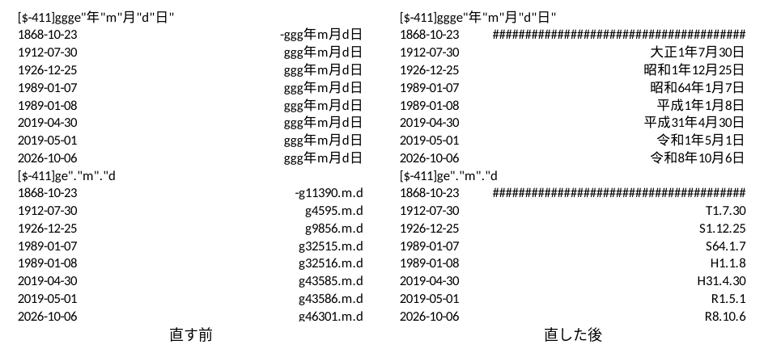

# ja-office-fixes

ONLYOFFICE と Euro-Office の文書エディターと表計算で、日本語の行の折り返し・縦書き・和暦を直すパッチです。
今は ONLYOFFICE Desktop Editors 9.4.0 に当てて使います。
ONLYOFFICE を元にしていますが、ONLYOFFICE(Ascensio System SIA)とは関係のない、独自の取り組みです。

[English](#english)

## 何を直すか

### 行の折り返し

- 仮名の間で行を折ります。今の ONLYOFFICE は、仮名の続きを 1 語として扱い、まとめて次の行へ送ります。
  そのため、行が早く終わります。
- 行の頭に置けない字(「。」「、」「」」など)が行に入らないときは、その字を 1 字だけ行末に
  はみ出させて置きます(追い込み)。Word と同じ形です。今の ONLYOFFICE は、前の字ごと次の行へ送るので、
  1 行の字の数が Word より 1〜2 字少なくなり、様式の行数やページ数が変わります。
- 行の頭に置けない字に、Word の禁則の「標準」の字(・、々、ゝゞヽヾ、゛゜、℃、半角の ｡｣､･ﾞﾟ)を足します。
  小書きの仮名と長音は、Word の「標準」と同じく行の頭に置けます。


### 縦書き

表のセルの縦書き(docx の `w:textDirection="tbRl"`)と、テキストボックスの縦書き(`vert="eaVert"`)で、
漢字・仮名・全角の英数字を立てて描きます。今の ONLYOFFICE は、すべての字を横倒しにします。
括弧・長音・欧文は、Word と同じく回したままにします。「、」「。」は字の枠の右上に寄せます。

 

### 和暦(表計算)

日本の Excel の和暦の表示形式で、日付を和暦で表示します。
`[$-411]ggge"年"m"月"d"日"` は「令和8年10月6日」、`[$-411]ge.m.d` は「R8.10.6」になります。
日本の Excel の組み込みの日付の表示形式も、この書き方です。
今の ONLYOFFICE は、「ggg年m月d日」や「g46301.m.d」のように表示が壊れます。

- `g` は元号の頭文字(R)、`gg` は元号の 1 字目(令)、`ggg` は元号(令和)です。
- `e` は元号の年、`ee` は 2 桁の元号の年です。`r` は `ee`、`rr` は `gggee` と同じです。
- 表示形式に `[$-411]` が無いときは、ブックの言語が日本語の場合に和暦にします。
- 表示形式の「G/標準」を、「標準」として扱います。



## 使い方(Linux)

このリポジトリは、直した ONLYOFFICE そのものは配っていません。
配っているのは、公式の ONLYOFFICE を取ってきて、手元でパッチを当てるスクリプト(`build.py`)です。

### ONLYOFFICE はどうするか

- ONLYOFFICE を先にインストールする必要はありません。
  `build.py` が公式の Linux 版を GitHub から取ってきて、`work/` の中に展開します。
- パッチを当てた ONLYOFFICE は、メニューに「ja-office-fixes」という名前で入ります。
- 文書(docx・doc・odt・rtf)をダブルクリックすると、パッチを当てた ONLYOFFICE で開きます。
- すでに ONLYOFFICE をインストールしている場合は、アンインストールしてかまいません。
  残しておいても、パッチを当てた物とは別に動きます。
  `build.py` は、インストール済みの ONLYOFFICE を書き換えません。
- インストール済みの ONLYOFFICE を残した場合、メニューの「ONLYOFFICE」から起動するのは、
  そちらの直っていない ONLYOFFICE です。
- パッチを当てた ONLYOFFICE は、自動では新しい版になりません。

### 要る物

- Linux(x86_64)
- git
- Python 3.12 以上
- ディスクの空き 約 2.1GB
- xdg-utils(ダブルクリックで開くアプリを設定するのに使います。無いときは、この設定だけを飛ばします)

### 1. このリポジトリを取ってくる

```bash
git clone https://github.com/aiseed-dev/ja-office-fixes.git
cd ja-office-fixes
```

### 2. 組み立てる

```bash
python3 build.py all
```

このコマンドは、次の 5 つを順に行います。

1. ONLYOFFICE のエディターのプログラム(sdkjs、約 320MB)を GitHub から取ってきます。
2. 公式の Linux 版 ONLYOFFICE Desktop Editors 9.4.0(約 345MB)を GitHub から取ってきて、展開します。
3. sdkjs にパッチを当てて、文書エディターと表計算のエディターを組み立てます。
4. 展開した Linux 版の文書エディターと表計算のエディターを、組み立てた物に入れ替えます。
5. メニューに「ja-office-fixes」を足します(`~/.local/share/applications/ja-office-fixes.desktop`)。
   あわせて、文書(docx・doc・odt・rtf)をダブルクリックしたときに開くアプリを、
   ja-office-fixes にします(`~/.config/mimeapps.list`)。
   表計算とプレゼンテーションのファイルを開くアプリは変えません。

取ってきた物は `work/` に残るので、2 回目からは取り直しません。

このコマンドが終われば、使えるようになっています。ほかにすることはありません。

### 3. 起動する

メニューの「ja-office-fixes」から起動します。
文書のファイルをダブルクリックしても起動します。

コマンドで起動するときは、次のようにします。

```bash
python3 build.py run
```

文書を開いて起動するときは、文書のファイル名を後ろに付けます。

```bash
python3 build.py run 文書.docx
```

起動した後は、普通の ONLYOFFICE と同じに使えます。
直してあるのは文書(docx など)と表計算(xlsx など)です。プレゼンテーションは公式のままです。

### パッチを新しくする

このリポジトリのパッチが新しくなったときは、次の 2 つのコマンドを使います。

```bash
git pull
python3 build.py all
```

`build.py` は、パッチが変わったことを見つけて、公式の sdkjs にパッチを当て直します。
パッチが変わっていなければ、当て直しません。

ja-office-fixes を開いているときは、すべての窓を閉じてから、もう一度起動します。
新しいパッチは、起動し直した後に効きます。

### 元に戻す

パッチを当てる前の、公式のエディターに戻すときは、次のコマンドを使います。

```bash
python3 build.py restore
```

もう一度パッチを当てた物にするときは、`python3 build.py install` を使います。
どちらの場合も、メニューの「ja-office-fixes」から起動できます。

このリポジトリのフォルダーを別の場所に移したときは、`python3 build.py menu` でメニューを作り直します。

使わなくなったときは、次のコマンドでメニューから外してから、このリポジトリのフォルダーを消します。
このコマンドは、文書をダブルクリックしたときに開くアプリも、システムの既定のアプリに戻します。

```bash
python3 build.py unmenu
```

### 対象の版

ONLYOFFICE Desktop Editors 9.4.0 です(sdkjs のタグ v9.4.0.129)。
パッチは Euro-Office の sdkjs にもそのまま当たります。

## 確かめ方

- `tests/documents/` の docx と xlsx を、直す前と直した後の ONLYOFFICE で印刷して比べました(上の画像)。
- sdkjs にもともとある組版の試験(段落・表・ハイフネーション・文字の組み立て・図の配置)を、node で回せるようにしました。
  パッチを当てても、すべて通ります。足した日本語の試験は、パッチの前は落ち、後は通ります。

- 表計算の表示形式の試験も、node で回せます。和暦の試験を足しました。

```bash
node tests/sdkjs_node/qunit.js work/sdkjs/tests/word/document-calculation/paragraph/paragraph-lines.js
SDKJS_PRODUCT=cell node tests/sdkjs_node/qunit.js work/sdkjs/tests/cell/spreadsheet-calculation/NumFormatParse.js
```

## まだ直していないこと

- ページ全体の縦書き(縦書きの節)。docx から読む変換器(core)の段階で設定が消えるので、sdkjs だけでは直せません。
- 縦書きの「、」「。」は位置を寄せただけで、書体の縦書き用の字形は使っていません。
- 元年の表示。`[$-ja-JP-x-gannen]` の表示形式も、元号の最初の年は「1年」と表示します。
- ルビ、傍点、漢数字、ふりがなの保存など。

## ライセンスと表示

- パッチとスクリプトは GNU Affero General Public License v3.0(AGPL-3.0)です([LICENSE](LICENSE))。
  パッチは ONLYOFFICE の sdkjs(AGPL-3.0)に手を入れたものです。
- ONLYOFFICE is a trademark of Ascensio System SIA. このリポジトリは ONLYOFFICE の公式の物ではありません。
- 手を入れた実行ファイルは配りません。利用者が公式の版を取り、手元でパッチを当てます。
- 1 つ目のパッチは、Yuito Murase さん(zeptometer)が ONLYOFFICE に出した
  [ONLYOFFICE/sdkjs#4885](https://github.com/ONLYOFFICE/sdkjs/pull/4885) と同じ直しに、試験を足したものです。

詳しくは [NOTICE.md](NOTICE.md) をご覧ください。

---

## English

Patches for the document and spreadsheet editors of ONLYOFFICE Desktop Editors that fix Japanese
line breaking, vertical writing and dates in the Japanese era. Based on ONLYOFFICE; not affiliated with Ascensio System SIA.

- Lines break between kana (they used to move to the next line as one word).
- A character that may not begin a line (。、」 …) hangs one character past the line end, as in Word,
  instead of pushing the character before it to the next line.
- Word's standard Japanese kinsoku characters are added to the "cannot begin a line" table.
- In vertical table cells (`tbRl`) and vertical text boxes (`eaVert`), ideographs, kana and
  full-width forms stand upright; brackets, dashes and Latin text stay turned with the line.
- Spreadsheet dates in the Japanese era: `[$-411]ggge"年"m"月"d"日"` shows 令和8年10月6日 and
  `[$-411]ge.m.d` shows R8.10.6, following ECMA-376 Part 1, 18.8.31 (g, gg, ggg, e, ee, r, rr).
  `G/標準` is read as General.

### Use (Linux)

No modified binaries are distributed. `build.py` downloads the official ONLYOFFICE and applies the
patches on your machine. You do not need to install ONLYOFFICE first, and an installed ONLYOFFICE
is not changed; you may uninstall it.

You need Linux (x86_64), git, Python 3.12 or later and about 2.1 GB of free disk space.

```bash
git clone https://github.com/aiseed-dev/ja-office-fixes.git
cd ja-office-fixes
python3 build.py all
```

`python3 build.py all` fetches ONLYOFFICE sdkjs (tag v9.4.0.129, about 320 MB) and the official
Linux package 9.4.0 (about 345 MB) into `work/`, applies the patches, builds the document and spreadsheet
editors and puts them into the package. It then adds "ja-office-fixes" to the desktop menu and makes it the app
that opens documents (docx, doc, odt, rtf) on a double-click. Spreadsheets and presentations keep
the app they had; the presentation editor is the official one.

- Start it from the menu, by double-clicking a document, or with `python3 build.py run [FILE]`.
- `python3 build.py restore` puts the official editors back; `python3 build.py install`
  puts the patched one in again.
- After `git pull`, `python3 build.py all` applies the patches again when they changed. Close the app
  and start it again to use them.
- `python3 build.py menu` makes the menu entry again, for example after moving the folder.
- To stop using it, run `python3 build.py unmenu`, which removes the menu entry and gives the
  documents back to the system's default app, then delete the folder.
- The patched app is not updated automatically.

The patches are AGPL-3.0, like the code they change. ONLYOFFICE is a trademark of Ascensio System SIA.
The first patch is the change of ONLYOFFICE/sdkjs#4885 by Yuito Murase (zeptometer), with tests.
