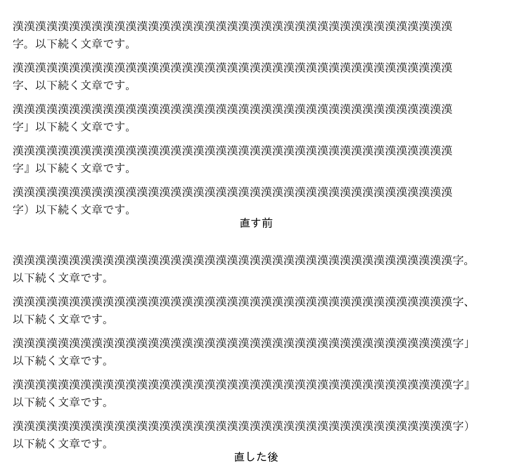
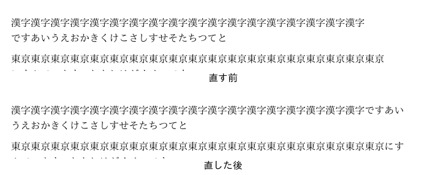
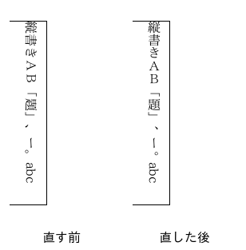
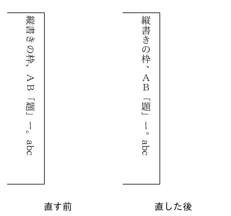

# ja-office-fixes

ONLYOFFICE と Euro-Office の文書エディターで、日本語の行の折り返しと縦書きを直すパッチです。
今は ONLYOFFICE Desktop Editors 9.4.0 に当てて使います。
ONLYOFFICE を元にしていますが、ONLYOFFICE(Ascensio System SIA)とは関係のない、独自の取り組みです。

[English](#english)

## 何を直すか

### 行の折り返し

- 仮名の間で行を折ります。今の ONLYOFFICE は、仮名の続きを 1 語として扱い、まとめて次の行へ送ります。
  そのため、行が早く終わります。
- 行の頭に置けない字(「。」「、」「」」など)が行に入らないときは、その字を 1 字だけ行末に
  はみ出させて置きます(追い込み)。Word と同じ形です。今の ONLYOFFICE は、前の字ごと次の行へ送るので、
  1 行の字の数が Word より 1〜2 字少なくなり、様式の行数やページ数が変わります。
- 行の頭に置けない字に、Word の禁則の「標準」の字(・、々、ゝゞヽヾ、゛゜、℃、半角の ｡｣､･ﾞﾟ)を足します。
  小書きの仮名と長音は、Word の「標準」と同じく行の頭に置けます。





### 縦書き

表のセルの縦書き(docx の `w:textDirection="tbRl"`)と、テキストボックスの縦書き(`vert="eaVert"`)で、
漢字・仮名・全角の英数字を立てて描きます。今の ONLYOFFICE は、すべての字を横倒しにします。
括弧・長音・欧文は、Word と同じく回したままにします。「、」「。」は字の枠の右上に寄せます。

 

## 使い方(Linux)

このリポジトリは、直した ONLYOFFICE そのものは配っていません。
配っているのは、公式の ONLYOFFICE を取ってきて、手元でパッチを当てるスクリプト(`build.py`)です。

### ONLYOFFICE はどうするか

- ONLYOFFICE を先にインストールする必要はありません。
  `build.py` が公式の Linux 版を GitHub から取ってきて、`work/` の中に展開します。
- すでに ONLYOFFICE をインストールしている場合も、そのままにしておきます。
  アンインストールする必要はなく、`build.py` はインストール済みの ONLYOFFICE を書き換えません。
- パッチを当てた ONLYOFFICE は、インストール済みの物とは別の、もう 1 つの ONLYOFFICE になります。
  使うときは、下の「3. 起動する」のとおり `python3 build.py run` で起動します。
- メニューのアイコンや、ファイルのダブルクリックで開くのは、インストール済みの公式の ONLYOFFICE です。
  そちらは直っていません。

### 要る物

- Linux(x86_64)
- git
- Python 3.12 以上
- ディスクの空き 約 2.1GB

### 1. このリポジトリを取ってくる

```bash
git clone https://github.com/aiseed-dev/ja-office-fixes.git
cd ja-office-fixes
```

### 2. 組み立てる

```bash
python3 build.py all
```

このコマンドは、次の 4 つを順に行います。

1. ONLYOFFICE の文書エディターのプログラム(sdkjs、約 320MB)を GitHub から取ってきます。
2. 公式の Linux 版 ONLYOFFICE Desktop Editors 9.4.0(約 345MB)を GitHub から取ってきて、展開します。
3. sdkjs にパッチを当てて、文書エディターを組み立てます。
4. 展開した Linux 版の文書エディターを、組み立てた物に入れ替えます。

取ってきた物は `work/` に残るので、2 回目からは取り直しません。

### 3. 起動する

```bash
python3 build.py run
```

文書を開いて起動するときは、文書のファイル名を後ろに付けます。

```bash
python3 build.py run 文書.docx
```

起動した後は、普通の ONLYOFFICE と同じに使えます。
直してあるのは文書(docx など)だけです。表計算とプレゼンテーションは公式のままです。

### 元に戻す

パッチを当てる前の、公式の文書エディターに戻すときは、次のコマンドを使います。

```bash
python3 build.py restore
```

もう一度パッチを当てた物にするときは、`python3 build.py install` を使います。
どちらの場合も、起動は `python3 build.py run` です。

使わなくなったときは、このリポジトリのフォルダーを消します。

### 対象の版

ONLYOFFICE Desktop Editors 9.4.0 です(sdkjs のタグ v9.4.0.129)。
パッチは Euro-Office の sdkjs にもそのまま当たります。

## 確かめ方

- `tests/documents/` の docx を、直す前と直した後の ONLYOFFICE で印刷して比べました(上の画像)。
- sdkjs にもともとある組版の試験(段落・表・ハイフネーション・文字の組み立て・図の配置)を、node で回せるようにしました。
  パッチを当てても、すべて通ります。足した日本語の試験は、パッチの前は落ち、後は通ります。

```bash
node tests/sdkjs_node/qunit.js work/sdkjs/tests/word/document-calculation/paragraph/paragraph-lines.js
```

## まだ直していないこと

- ページ全体の縦書き(縦書きの節)。docx から読む変換器(core)の段階で設定が消えるので、sdkjs だけでは直せません。
- 縦書きの「、」「。」は位置を寄せただけで、書体の縦書き用の字形は使っていません。
- ルビ、傍点、和暦、漢数字、ふりがなの保存など。

## ライセンスと表示

- パッチとスクリプトは GNU Affero General Public License v3.0(AGPL-3.0)です([LICENSE](LICENSE))。
  パッチは ONLYOFFICE の sdkjs(AGPL-3.0)に手を入れたものです。
- ONLYOFFICE is a trademark of Ascensio System SIA. このリポジトリは ONLYOFFICE の公式の物ではありません。
- 手を入れた実行ファイルは配りません。利用者が公式の版を取り、手元でパッチを当てます。
- 1 つ目のパッチは、Yuito Murase さん(zeptometer)が ONLYOFFICE に出した
  [ONLYOFFICE/sdkjs#4885](https://github.com/ONLYOFFICE/sdkjs/pull/4885) と同じ直しに、試験を足したものです。

詳しくは [NOTICE.md](NOTICE.md) をご覧ください。

---

## English

Patches for the document editor of ONLYOFFICE Desktop Editors that fix Japanese line breaking and
vertical writing. Based on ONLYOFFICE; not affiliated with Ascensio System SIA.

- Lines break between kana (they used to move to the next line as one word).
- A character that may not begin a line (。、」 …) hangs one character past the line end, as in Word,
  instead of pushing the character before it to the next line.
- Word's standard Japanese kinsoku characters are added to the "cannot begin a line" table.
- In vertical table cells (`tbRl`) and vertical text boxes (`eaVert`), ideographs, kana and
  full-width forms stand upright; brackets, dashes and Latin text stay turned with the line.

`python3 build.py all` fetches ONLYOFFICE sdkjs (tag v9.4.0.129) and the official Linux package
9.4.0, applies the patches, builds the word editor and puts it into the package;
`python3 build.py run` starts it. No modified binaries are distributed.

The patches are AGPL-3.0, like the code they change. ONLYOFFICE is a trademark of Ascensio System SIA.
The first patch is the change of ONLYOFFICE/sdkjs#4885 by Yuito Murase (zeptometer), with tests.
